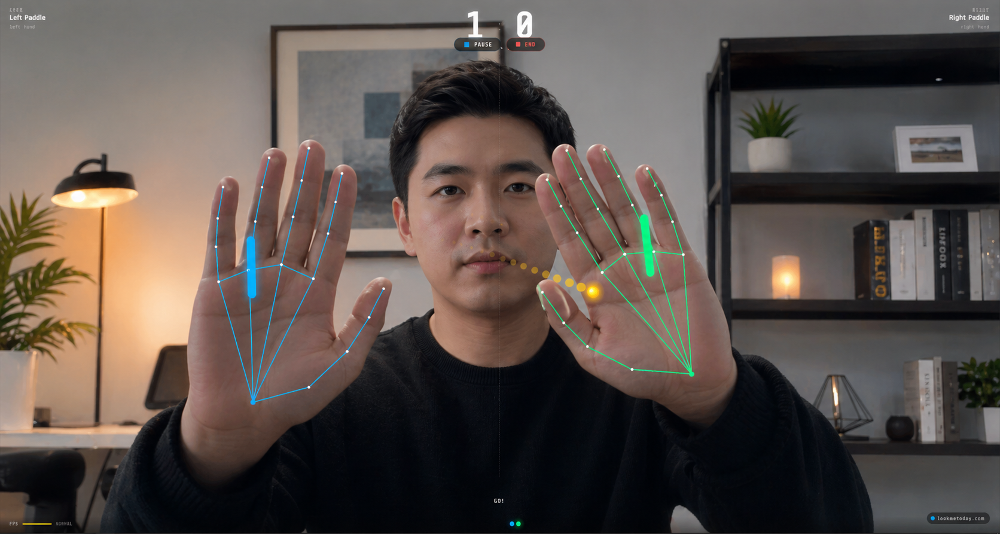

# 🏓 Ping Pong PRO

**Play ping pong with your hands — no controller needed.**

Just open your webcam and wave your hands. That's it.

---

## How it works

Your webcam tracks your hands in real time. Move your left hand to control the left paddle, right hand for the right paddle — or battle a friend online with a room code.

- **Solo mode** — both hands, one screen
- **Online mode** — share a 6-digit code, play against anyone
- **4 speed levels** — from casual to chaos
- **Force sensing** — swing harder, hit faster

---

## Download

**[⬇ Download for Windows — Free](https://github.com/splove/PingPong-PRO/releases/download/v1.0.0/Ping.Pong.PRO.Setup.1.0.0.exe)**

73 MB · Windows 10 / 11 · Requires a webcam

> Windows may show a security warning on first launch. Click **"More info" → "Run anyway"** to proceed. The file is safe.

---

## Requirements

- Windows 10 or 11 (64-bit)
- A webcam (built-in or USB)
- That's all

---

  Made with ❤️ · <a href="https://game.lookmetoday.com/pingpong">lookmetoday.com</a>

